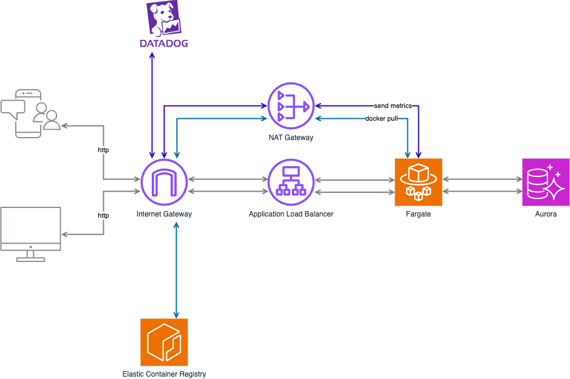

# 概要

このリポジトリをクローンし、後述の `terraform apply` コマンドなどを実行すると、以下アーキテクチャ図の AWS リソースが作成され、Go アプリケーションコンテナ ( REST API ) および Datadog Agent コンテナが ECS Fargate にデプロイされます。



# 前提条件

- [AWS CLI](https://docs.aws.amazon.com/cli/latest/userguide/getting-started-install.html) をインストール済みであること。
- [Terraform](https://developer.hashicorp.com/terraform/install) をインストール済みであること。
- [Docker](https://docs.docker.com/engine/install/) をインストール済みであること。

# ビルド方法

## `terraform/terraform.tfvars`　ファイルの修正

- AWS リソース名の重複を避けるため、任意の値を `env` に設定してください。
- こちらの[サイト](https://www.cman.jp/network/support/go_access.cgi)でグローバル IP アドレスを確認し、`global_ip_address` に設定してください。
- Datadog の API キーを `dd_api_key` に設定してください。

## AWS 認証情報の設定

- 以下ドキュメントのいずれかを参考に、AWS 認証情報を設定してください。
  - [Configure the AWS CLI with IAM Identity Center authentication](https://docs.aws.amazon.com/cli/latest/userguide/cli-configure-sso.html#sso-configure-profile-token-auto-sso)
  - [Environment variables to configure the AWS CLI](https://docs.aws.amazon.com/cli/latest/userguide/cli-configure-envvars.html?icmpid=docs_sso_user_portal)
  - [Configuration and credential file settings](https://docs.aws.amazon.com/cli/latest/userguide/cli-configure-files.html)
  - [Authenticate with short-term credentials](https://docs.aws.amazon.com/cli/latest/userguide/cli-authentication-short-term.html)

## コマンド実行

- 以下コマンドの `${ENV}` を `env` の値に置き換えてください。
- 一回目の `terraform apply` コマンド実行時に、AWS アカウント ID ( `aws_account_id` ) が出力されます。以下コマンドの `${AWS_ACCOUNT_ID}` をその AWS アカウント ID に置き換えてください。
- `terraform` ディレクトリで以下のコマンドを実行してください。

```bash
terraform init

terraform apply -target=aws_ecr_repository.repository

aws ecr get-login-password --region ap-northeast-1 | docker login --username AWS --password-stdin ${AWS_ACCOUNT_ID}.dkr.ecr.ap-northeast-1.amazonaws.com

docker build .. \
    -t ${AWS_ACCOUNT_ID}.dkr.ecr.ap-northeast-1.amazonaws.com/${ENV}-ecr-repository \
    --platform linux/arm64 \
    --build-arg DD_GIT_REPOSITORY_URL=github.com/ogu1101/go-app-on-ecs-fargate-with-datadog \
    --build-arg DD_GIT_COMMIT_SHA=$(git rev-parse HEAD)

docker push ${AWS_ACCOUNT_ID}.dkr.ecr.ap-northeast-1.amazonaws.com/${ENV}-ecr-repository:latest

terraform apply
```

## 動作確認

- 二回目の `terraform apply` コマンド実行時に、ALB の DNS 名 ( `alb_dns_name` ) が出力されます。以下コマンドの `${ALB_DNS_NAME}` をその DNS 名に置き換えてください。

```bash
curl http://${ALB_DNS_NAME}:8080/albums \
    --include \
    --header "Content-Type: application/json" \
    --request "POST" \
    --data '{"title": "The Modern Sound of Betty Carter","artist": "Betty Carter","price": 49.99}'

curl http://${ALB_DNS_NAME}:8080/albums/1
```

# References

- [Tutorial: Accessing a relational database](https://go.dev/doc/tutorial/database-access)
- [Tutorial: Developing a RESTful API with Go and Gin](https://go.dev/doc/tutorial/web-service-gin)
- [Build your Go image](https://docs.docker.com/guides/language/golang/build-images/)
- [golang - Official Image](https://hub.docker.com/_/golang)
- [mysql - Official Image](https://hub.docker.com/_/mysql)
- [Setting Up Database Monitoring for self hosted MySQL](https://docs.datadoghq.com/database_monitoring/setup_mysql/selfhosted/?tab=mysql56)
- [AWS CloudFormation を使用した Amazon ECS リソースの作成](https://docs.aws.amazon.com/ja_jp/AmazonECS/latest/developerguide/creating-resources-with-cloudformation.html)
- [Private registry authentication in Amazon ECR](https://docs.aws.amazon.com/AmazonECR/latest/userguide/registry_auth.html)
- [AWS リソース別の Terraform 公式ページ](https://registry.terraform.io/providers/hashicorp/aws/latest/docs)
