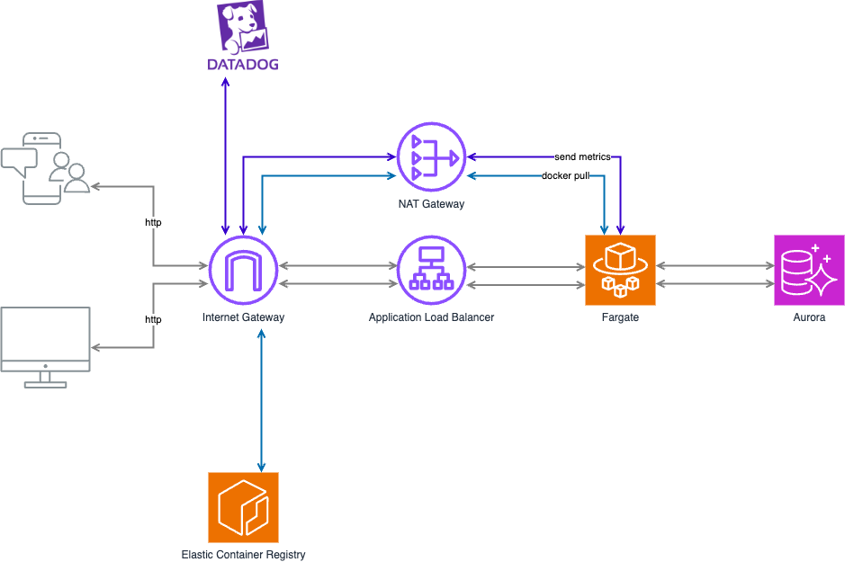

# go-app-on-ecs-fargate-with-datadog



## Overview

Cloning this repository and running the `terraform apply` commands described below will provision the AWS resources shown in the architecture diagram above, then deploy a Go application container (REST API) and a Datadog Agent container to ECS Fargate.

---

## Table of Contents

- [Prerequisites](#prerequisites)
- [Build & Deployment](#build--deployment)
  - [1. Edit terraform.tfvars](#1-edit-terraformtfvars)
  - [2. Configure AWS Credentials](#2-configure-aws-credentials)
  - [3. Run Commands](#3-run-commands)
  - [4. Verify the Deployment](#4-verify-the-deployment)
- [References](#references)

---

## Prerequisites

- [AWS CLI](https://docs.aws.amazon.com/cli/latest/userguide/getting-started-install.html) must be installed.
- [Terraform](https://developer.hashicorp.com/terraform/install) must be installed.
- [Docker](https://docs.docker.com/engine/install/) must be installed.

---

## Build & Deployment

### 1. Edit `terraform/terraform.tfvars`

- Set an arbitrary value for `env` to avoid naming conflicts with existing AWS resources.
- Look up your global IP address using [this site](https://www.cman.jp/network/support/go_access.cgi) and set it as `global_ip_address`.
- Set your Datadog API key as `dd_api_key`.

### 2. Configure AWS Credentials

Configure your AWS credentials using one of the following methods:

- [Configure the AWS CLI with IAM Identity Center authentication](https://docs.aws.amazon.com/cli/latest/userguide/cli-configure-sso.html#sso-configure-profile-token-auto-sso)
- [Environment variables to configure the AWS CLI](https://docs.aws.amazon.com/cli/latest/userguide/cli-configure-envvars.html?icmpid=docs_sso_user_portal)
- [Configuration and credential file settings](https://docs.aws.amazon.com/cli/latest/userguide/cli-configure-files.html)
- [Authenticate with short-term credentials](https://docs.aws.amazon.com/cli/latest/userguide/cli-authentication-short-term.html)

### 3. Run Commands

- Replace `${ENV}` in the commands below with the value you set for `env`.
- Replace `${AWS_ACCOUNT_ID}` with your AWS account ID.
- Run the following commands from the `terraform` directory.

```bash
terraform init

terraform apply -target=aws_ecr_repository.repository

aws ecr get-login-password --region ap-northeast-1 | docker login --username AWS --password-stdin ${AWS_ACCOUNT_ID}.dkr.ecr.ap-northeast-1.amazonaws.com

docker build .. -t ${AWS_ACCOUNT_ID}.dkr.ecr.ap-northeast-1.amazonaws.com/${ENV}-ecr-repository --platform linux/arm64 --build-arg DD_GIT_REPOSITORY_URL=github.com/ogu1101/go-app-on-ecs-fargate-with-datadog --build-arg DD_GIT_COMMIT_SHA=$(git rev-parse HEAD)

docker push ${AWS_ACCOUNT_ID}.dkr.ecr.ap-northeast-1.amazonaws.com/${ENV}-ecr-repository:latest

terraform apply
```

### 4. Verify the Deployment

The ALB DNS name (`alb_dns_name`) is printed as output when the second `terraform apply` completes. Replace `${ALB_DNS_NAME}` in the commands below with that DNS name.

```bash
curl http://${ALB_DNS_NAME}:8080/albums --include --header "Content-Type: application/json" --request "POST" --data '{"title": "The Modern Sound of Betty Carter","artist": "Betty Carter","price": 49.99}'

curl http://${ALB_DNS_NAME}:8080/albums/1
```

---

## References

- [Tutorial: Accessing a relational database](https://go.dev/doc/tutorial/database-access)
- [Tutorial: Developing a RESTful API with Go and Gin](https://go.dev/doc/tutorial/web-service-gin)
- [Build your Go image](https://docs.docker.com/guides/language/golang/build-images/)
- [golang - Official Image](https://hub.docker.com/_/golang)
- [mysql - Official Image](https://hub.docker.com/_/mysql)
- [Setting Up Database Monitoring for self hosted MySQL](https://docs.datadoghq.com/database_monitoring/setup_mysql/selfhosted/?tab=mysql56)
- [Creating Amazon ECS resources using AWS CloudFormation](https://docs.aws.amazon.com/AmazonECS/latest/developerguide/creating-resources-with-cloudformation.html)
- [Private registry authentication in Amazon ECR](https://docs.aws.amazon.com/AmazonECR/latest/userguide/registry_auth.html)
- [Terraform AWS Provider Documentation](https://registry.terraform.io/providers/hashicorp/aws/latest/docs)